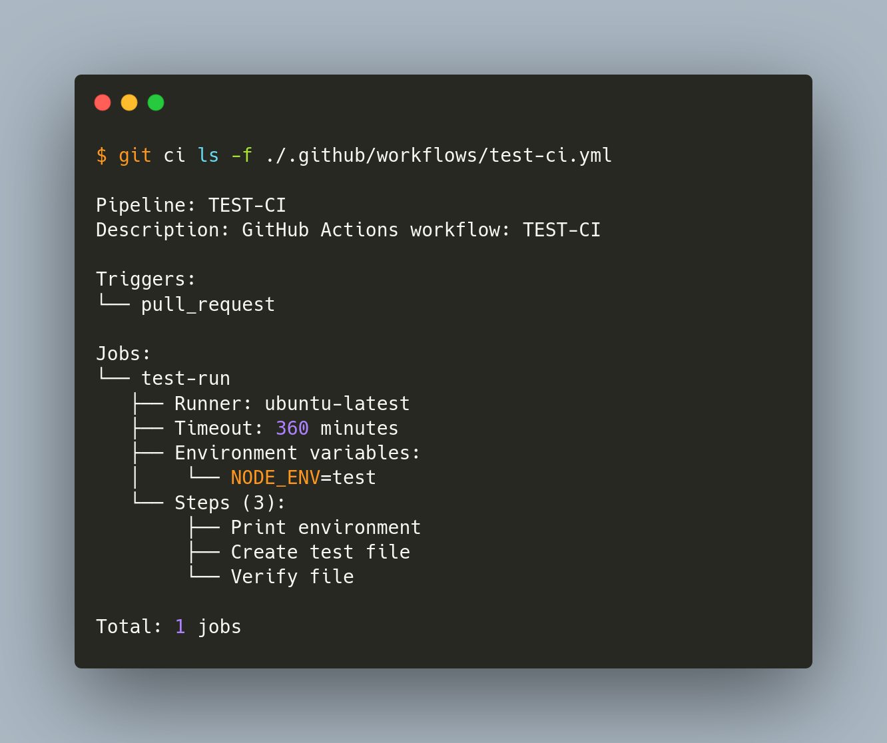

# git-ci



Run CI/CD pipelines locally with native Go support.

## FEATURES

- Local execution of CI/CD workflows
- Multiple runner support (Bash, Docker, Podman)
- Parser support for GitHub Actions, GitLab CI, Azure DevOps (planned)
- Parallel job execution
- Environment management
- Pipeline validation

## SUPPORTED PLATFORMS

### PARSERS

- [x] GitHub Actions
- [x] GitLab CI
- [ ] Azure DevOps
- [ ] Bitbucket Pipelines
- [ ] CircleCI

### RUNNERS

- [x] Bash (native shell execution)
- [x] Docker (containerized execution)
- [ ] Podman (rootless containers)
- [ ] Kubernetes (cloud-native execution)
- [ ] AWS Lambda (serverless)
- [ ] Firecracker (microVMs)

## REQUIREMENTS

- Go 1.23+ (for building from source)
- Docker/Podman (optional, for containerized execution)
- Kubernetes cluster (optional, for k8s runner)

## INSTALLATION

```bash
# from source
go install github.com/sanix-darker/git-ci@latest

# download binary
curl -L https://github.com/sanix-darker/git-ci/releases/latest/download/gci-$(uname -s)-$(uname -m) -o gci
chmod +x gci
sudo mv git ci /usr/local/bin/

# create git alias
git config --global alias.ci '!gci'
```

## QUICK START

```bash
# list jobs from detected workflow
git ci ls

# to run all jobs
git ci run

# run specific job
git ci run --job test

# run with different runners
git ci run --runner docker
git ci run --runner podman

# validate pipeline
git ci validate

# initialize new pipeline
git ci init --provider github --template go
```

## USAGE

### BASIC COMMANDS

```bash
# list available commands
git ci help

# list jobs and pipelines
git ci ls -f .github/workflows/ci.yml

# run pipeline
git ci run -f .gitlab-ci.yml

# run specific stage
git ci run --stage test

# parallel execution
git ci run --parallel --max-parallel 4

# dry run
git ci run --dry-run
```

### ENVIRONMENT MANAGEMENT

```bash
# set environment variables
git ci env set KEY=value

# load from file
git ci env load -f .env

# list current environment
git ci env list
```

### CONFIGURATION

You can create `.git-ci.yml`:

```yaml
defaults:
  runner: docker
  timeout: 30
  parallel: false
  max_parallel: 4

environment:
  CI: "true"
  GIT_CI: "true"

docker:
  pull: true
  network: bridge
  volumes:
    - ./cache:/cache

cache:
  enabled: true
  paths:
    - node_modules
    - .cache
    - vendor

artifacts:
  paths:
    - dist
    - build
  expire_in: 1 week
```

## CLI REFERENCE

### GLOBAL OPTIONS

```bash
--verbose, -v         Verbose output
--debug              Debug mode
--quiet, -q          Suppress output
--config, -c VALUE   Config file path
--workdir, -w VALUE  Working directory
```

### RUN OPTIONS

```bash
--file, -f VALUE     Pipeline file
--job, -j VALUE      Specific job
--stage, -s VALUE    Specific stage
--runner VALUE       Runner type (bash|docker|podman|kubernetes)
--parallel, -p       Parallel execution
--max-parallel N     Max parallel jobs
--timeout, -t MIN    Job timeout
--dry-run, -n        Simulate execution
--env, -e KEY=VALUE  Environment variables
--env-file FILE      Load env from file
```

## EXAMPLES

### GITHUB ACTIONS

```bash
# run workflow
git ci run -f .github/workflows/ci.yml

# run matrix job
git ci run --job "test (ubuntu-latest, 1.20)"

# run with docker
git ci run --runner docker --pull
```

### GITLAB CI
```bash
# run pipeline
git ci run -f .gitlab-ci.yml

# run specific stage
git ci run --stage deploy

# run with services
git ci run --job integration-test
```

### ADVANCED USAGE

```bash
# complex filtering
git ci run --only "test-*" --except "test-integration"

# custom runner with volumes
git ci run --runner podman --volume $PWD/data:/data:ro
```

## DEVELOPMENT
```bash
# clone repository
git clone https://github.com/sanix-darker/git-ci
cd git-ci

# build
make build

# run tests
make test

# install locally
make install
```

## CONTRIBUTING

Contributions are welcome !
Please read the contributing guidelines before submitting PRs.

## LICENSE

MIT License - see LICENSE file for details.

## AUTHOR

[sanix-darker](https://github.com/sanix-darker)
