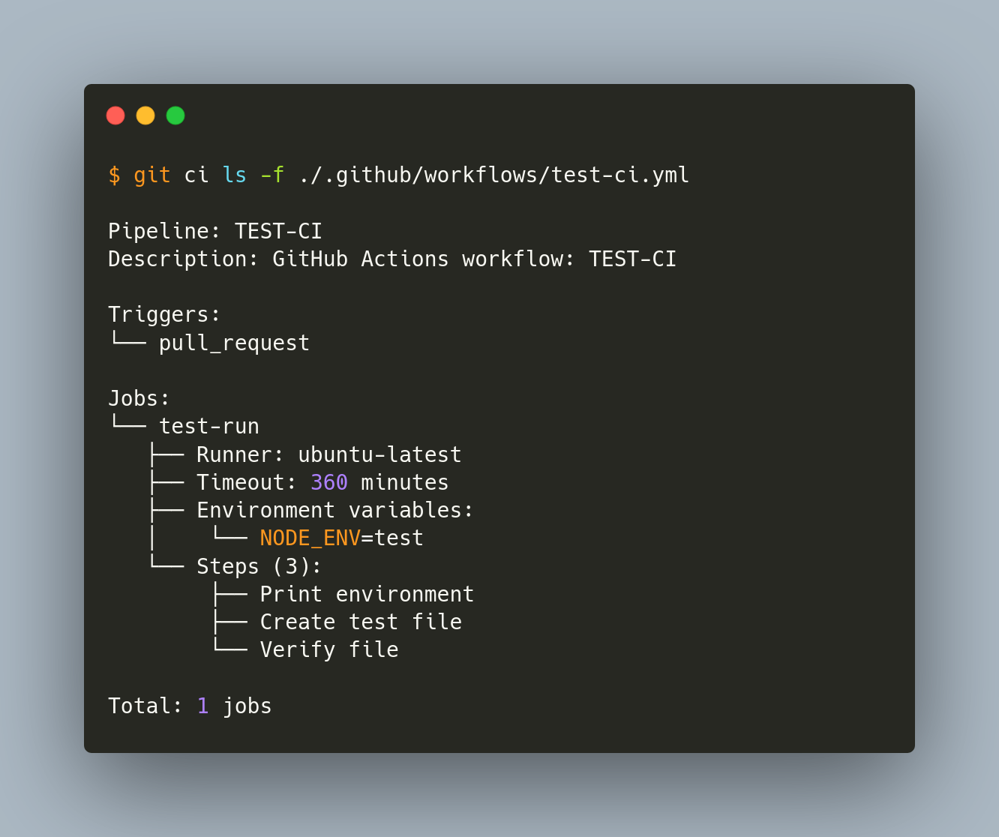

# git-ci



Run CI/CD pipelines locally with native Go support.

**⚠️NOTE:** This project is still under development, no stable release so far.

## FEATURES

- Local execution of CI/CD workflows
- Multiple runner support (Bash, Docker, Podman)
- Parser support for GitHub Actions and GitLab CI
- Matrix strategy expansion (Cartesian product with include/exclude)
- Topological dependency resolution (Kahn's algorithm)
- Docker service containers with bridge networks and DNS aliases
- Parallel job execution with configurable concurrency
- Resource limits (memory, CPUs) for containerized jobs
- Content-based provider auto-detection
- Strict validation mode
- Environment management
- Pipeline validation and dry-run mode
- Job filtering with `--only` / `--except` (wildcard support)

## SUPPORTED PLATFORMS

### PARSERS

- [x] GitHub Actions
- [x] GitLab CI
- [ ] Azure DevOps (template-only, falls back to GitHub parser)
- [ ] Bitbucket Pipelines (template-only, falls back to GitHub parser)
- [ ] CircleCI

### RUNNERS

- [x] Bash (native shell execution)
- [x] Docker (containerized execution)
- [x] Podman (rootless containers)
- [ ] Kubernetes (cloud-native execution)
- [ ] AWS Lambda (serverless)
- [ ] Firecracker (microVMs)

## REQUIREMENTS

- Go 1.24+ (for building from source)
- Docker/Podman (optional, for containerized execution)

## INSTALLATION

```bash
# from source
go install github.com/sanix-darker/git-ci@latest

# download binary
curl -L https://github.com/sanix-darker/git-ci/releases/latest/download/gci-$(uname -s)-$(uname -m) -o gci
chmod +x gci
sudo mv gci /usr/local/bin/

# create git alias
git config --global alias.ci '!gci'
```

## QUICK START

```bash
# list jobs from detected workflow
git ci ls

# run all jobs
git ci run

# run specific job
git ci run --job test

# run with Docker
git ci run --docker

# run with Podman
git ci run --podman

# dry run (simulate execution)
git ci run --dry-run

# parallel execution
git ci run --parallel --max-parallel 4

# validate pipeline
git ci validate

# strict validation
git ci validate --strict

# initialize new pipeline
git ci init --provider github --template go

# filter jobs
git ci run --only "test-*" --except "test-integration"

# resource limits
git ci run --docker --memory 2g --cpus 2
```

## CLI REFERENCE

### GLOBAL OPTIONS

```
--verbose            Enable verbose output            [$GIT_CI_VERBOSE]
--debug              Enable debug mode                [$GIT_CI_DEBUG]
--quiet, -q          Suppress output                  [$GIT_CI_QUIET]
--config, -c VALUE   Config file path                 [$GIT_CI_CONFIG]
--workdir, -w VALUE  Working directory (default: ".")  [$GIT_CI_WORKDIR]
--version            Print version
--help, -h           Show help
```

### list (alias: ls)

List jobs and pipelines.

```
--file, -f VALUE   Pipeline file path          [$GIT_CI_FILE]
--format VALUE     Output format: tree, json, yaml (default: "tree")
```

```bash
git ci ls
git ci ls -f .github/workflows/ci.yml
git ci ls --format json
```

### run (aliases: r, exec)

Run jobs or pipelines.

```
--file, -f VALUE          Pipeline file path                    [$GIT_CI_FILE]
--job, -j VALUE           Job name to run                       [$GIT_CI_JOB]
--stage, -s VALUE         Stage name to run                     [$GIT_CI_STAGE]
--only VALUE              Run only these jobs (repeatable)      [$GIT_CI_ONLY]
--except VALUE            Run all jobs except these (repeatable) [$GIT_CI_EXCEPT]
--docker, -d              Use Docker runner                     [$GIT_CI_DOCKER]
--podman                  Use Podman runner                     [$GIT_CI_PODMAN]
--dry-run, -n             Perform a dry run                     [$GIT_CI_DRY_RUN]
--parallel, -p            Run jobs in parallel                  [$GIT_CI_PARALLEL]
--max-parallel VALUE      Maximum parallel jobs (default: NumCPU) [$GIT_CI_MAX_PARALLEL]
--continue-on-error       Continue running on error             [$GIT_CI_CONTINUE_ON_ERROR]
--timeout, -t VALUE       Job timeout in minutes (default: 30)  [$GIT_CI_TIMEOUT]
--env, -e VALUE           Set environment variables KEY=VALUE   [$GIT_CI_ENV]
--env-file VALUE          Environment file path                 [$GIT_CI_ENV_FILE]
--pull                    Pull docker images (default: true)    [$GIT_CI_PULL]
--no-cache                Disable cache                         [$GIT_CI_NO_CACHE]
--volume, -V VALUE        Bind mount volumes (repeatable)
--network VALUE           Docker network mode (default: "bridge") [$GIT_CI_NETWORK]
--memory VALUE            Container memory limit (e.g., 2g, 512m) [$GIT_CI_MEMORY]
--cpus VALUE              Container CPU limit (e.g., 2, 0.5)   [$GIT_CI_CPUS]
```

```bash
git ci run
git ci r --job test --docker
git ci exec -f .gitlab-ci.yml --stage deploy
git ci run --docker --volume $PWD/data:/data:ro --memory 2g --cpus 2
git ci run --only "test-*" --except "test-integration"
git ci run --continue-on-error --parallel
```

### validate (aliases: check, v)

Validate pipeline syntax.

```
--file, -f VALUE      Pipeline file path                 [$GIT_CI_FILE]
--provider, -p VALUE  CI provider: github, gitlab, auto (default: "auto")
--strict              Enable strict validation
```

```bash
git ci validate
git ci check -f .gitlab-ci.yml
git ci v --strict --provider github
```

### init

Initialize a new pipeline.

```
--provider, -p VALUE  CI provider: github, gitlab (default: "github")
--template, -t VALUE  Template: basic, node, python, go, docker (default: "basic")
--output, -o VALUE    Output file path
--force               Overwrite existing file
```

```bash
git ci init
git ci init --provider gitlab --template python
git ci init -t go -o .github/workflows/ci.yml --force
```

### clean

Clean up resources.

```
--all, -a       Clean all resources
--containers    Clean containers only
--images        Clean images only
--cache         Clean cache only
--force, -f     Force cleanup
```

```bash
git ci clean --all
git ci clean --containers --force
git ci clean --images
```

### env

Manage environment variables.

```bash
# list environment variables
git ci env list

# set environment variables
git ci env set KEY=value OTHER=value2
git ci env set KEY=value --save --file .env

# load from file
git ci env load
git ci env load -f .env.production
```

### config

Manage configuration.

```bash
# show current configuration
git ci config show

# initialize configuration file
git ci config init
git ci config init --output custom-config.yml --force
```

## FEATURES IN DEPTH

### Matrix Strategy Expansion

Jobs with matrix strategies are expanded into concrete job instances via Cartesian product. Supports `include` entries to extend combinations and `exclude` entries to filter them out. Matrix values are injected as environment variables (both raw keys and `MATRIX_` prefixed).

```yaml
# GitHub Actions example
strategy:
  matrix:
    os: [ubuntu-latest, macos-latest]
    go: ["1.21", "1.22"]
    include:
      - os: ubuntu-latest
        go: "1.22"
        experimental: true
    exclude:
      - os: macos-latest
        go: "1.21"
```

### Dependency Resolution

Jobs with `needs` are resolved using Kahn's algorithm for topological sorting. Circular dependencies are detected and reported. Jobs are grouped into dependency levels for parallel execution — all jobs in a level can run concurrently once their dependencies complete.

### Docker Service Containers

When a job defines `services`, git-ci creates a dedicated bridge network, starts service containers with DNS aliases matching their names, and attaches the job container to the same network. Services are accessible by name from the job container. Cleanup is automatic.

```yaml
services:
  postgres:
    image: postgres:15
    env:
      POSTGRES_PASSWORD: test
  redis:
    image: redis:7
```

### Resource Limits

Container memory and CPU limits can be set via `--memory` and `--cpus` flags:

```bash
git ci run --docker --memory 2g --cpus 1.5
```

### Provider Auto-Detection

git-ci auto-detects the CI provider from:
1. File path patterns (`.github/workflows/*` → GitHub, `.gitlab-ci.yml` → GitLab)
2. File content analysis (`on:` + `runs-on:` → GitHub, `stages:` + `script:` → GitLab)
3. Environment variables (`GITHUB_ACTIONS`, `GITLAB_CI`)

### Strict Validation

Use `--strict` with the `validate` command for stricter checks:

```bash
git ci validate --strict
```

## CONFIGURATION

Create a `.git-ci.yml` file in your project root:

```yaml
defaults:
  runner: docker
  timeout: 30
  parallel: false
  max_parallel: 4

environment:
  CI: "true"
  GIT_CI: "true"

docker:
  pull: true
  network: bridge
  volumes:
    - ./cache:/cache

cache:
  enabled: true
  paths:
    - node_modules
    - .cache
    - vendor

artifacts:
  paths:
    - dist
    - build
  expire_in: 1 week
```

Initialize with: `git ci config init`

## ENVIRONMENT VARIABLES

All flags can be configured via environment variables:

| Variable | Description | Default |
|---|---|---|
| `GIT_CI_VERBOSE` | Enable verbose output | `false` |
| `GIT_CI_DEBUG` | Enable debug mode | `false` |
| `GIT_CI_QUIET` | Suppress output | `false` |
| `GIT_CI_CONFIG` | Config file path | |
| `GIT_CI_WORKDIR` | Working directory | `.` |
| `GIT_CI_FILE` | Pipeline file path | auto-detected |
| `GIT_CI_JOB` | Job name to run | |
| `GIT_CI_STAGE` | Stage name to run | |
| `GIT_CI_ONLY` | Run only these jobs | |
| `GIT_CI_EXCEPT` | Exclude these jobs | |
| `GIT_CI_DOCKER` | Use Docker runner | `false` |
| `GIT_CI_PODMAN` | Use Podman runner | `false` |
| `GIT_CI_DRY_RUN` | Dry run mode | `false` |
| `GIT_CI_PARALLEL` | Parallel execution | `false` |
| `GIT_CI_MAX_PARALLEL` | Max parallel jobs | NumCPU |
| `GIT_CI_CONTINUE_ON_ERROR` | Continue on error | `false` |
| `GIT_CI_TIMEOUT` | Job timeout (minutes) | `30` |
| `GIT_CI_ENV` | Environment variables | |
| `GIT_CI_ENV_FILE` | Env file path | |
| `GIT_CI_PULL` | Pull docker images | `true` |
| `GIT_CI_NO_CACHE` | Disable cache | `false` |
| `GIT_CI_NETWORK` | Docker network mode | `bridge` |
| `GIT_CI_MEMORY` | Container memory limit | |
| `GIT_CI_CPUS` | Container CPU limit | |

Additionally, git-ci sets these variables at runtime:
- `GIT_CI=true`
- `CI=true`
- `GIT_CI_VERSION=<version>`

## EXAMPLES

### GitHub Actions

```bash
# run workflow
git ci run -f .github/workflows/ci.yml

# run specific job with Docker
git ci run --job test --docker

# run matrix job
git ci run --job "test (ubuntu-latest, 1.22)"
```

### GitLab CI

```bash
# run pipeline
git ci run -f .gitlab-ci.yml

# run specific stage
git ci run --stage deploy

# run with services
git ci run --job integration-test --docker
```

### Advanced Usage

```bash
# job filtering with wildcards
git ci run --only "test-*" --except "test-integration"

# custom volumes and resource limits
git ci run --docker --volume $PWD/data:/data:ro --memory 2g --cpus 2

# continue past failures
git ci run --continue-on-error --parallel

# export job list as JSON
git ci ls --format json

# dry run with verbose output
git ci run --dry-run --verbose
```

## DEVELOPMENT

```bash
# clone repository
git clone https://github.com/sanix-darker/git-ci
cd git-ci

# build
make build

# run tests
make test

# run all checks (fmt, vet, lint, test)
make check

# run CI pipeline locally
make ci

# generate coverage report
make coverage

# run benchmarks
make bench

# install locally
make install

# run in development mode (hot reload)
make dev

# list jobs using the built binary
make list

# run a specific job
make run-job JOB=test

# run a job with Docker
make run-docker JOB=test

# display project info
make info
```

## DOCKER

The project includes a multi-stage Dockerfile:

| Stage | Purpose |
|---|---|
| `development` | Full dev environment with Go toolchain, linter, and dependencies |
| `builder` | Compiles the binary with version injection via LDFLAGS |
| `test` | Runs unit tests with race detection and coverage |
| `runtime` | Minimal Ubuntu image with just the `gci` binary |
| `integration-test` | Runtime image with test fixtures |

```bash
# build Docker image
make docker

# run in Docker
make docker-run ARGS="ls"

# run full Docker test suite (unit + build + integration)
make docker-test

# run unit tests in Docker
make docker-unit

# run integration tests in Docker
make docker-integration
```

## CONTRIBUTING

Contributions are welcome!
Please read the contributing guidelines before submitting PRs.

## LICENSE

MIT License - see LICENSE file for details.

## AUTHOR

[sanix-darker](https://github.com/sanix-darker)
